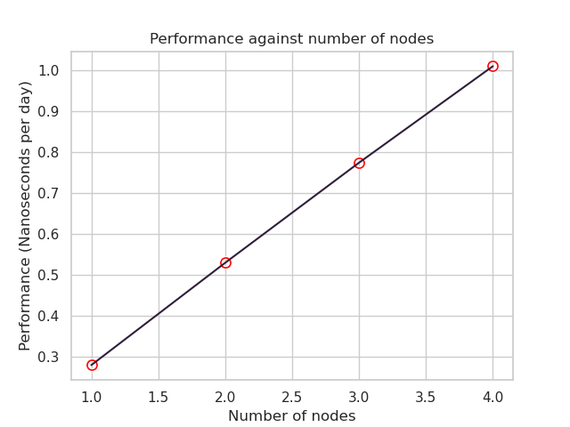
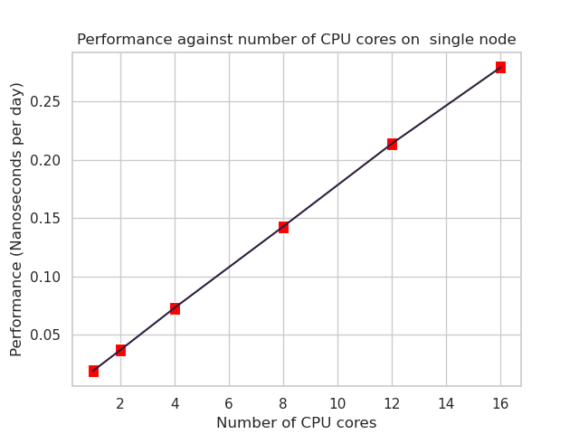

# UKSCC-Submission

## NAMD

### Build

The build script for NAMD can be found in [namd-build.sh](./namd/build.sh).

### Run

The slurm script used for NAMD can be found in [namd-run.sh](./namd/run.sh), and
is ran with the following command:

```sh
sbatch -N <num_nodes> ./namd-run.sh
```

For example, for a single node run, you would run:

```sh
sbatch -N 1 ./namd-run.sh
```

### Scaling Across Nodes

NAMD performance scaled very strongly as you increased the number of nodes, with
performance increasing linearly with the number of nodes. This can be seen on
this graph:



### Scaling Across Cores

NAMD performance also scaled very strongly as you increased the number of cores,
with performance increasing linearly with the number of cores. This can be seen
on this graph:



### What is NAMD

NAMD is a molecular dynamics simulation, meaning that it attempts to simulate
the motion of atoms and molecules. The STMV model is a benchmark model for NAMD
with around 1 million atoms, modelling the Satellite Tobaco Mosaic Virus. It has
been listed as a standard NAMD benchmark and has been used by [AMD][1] and
[Dell][2].

### Bottlenecks

NAMD is compute-bound up to 4 nodes. We can verify this to be true by observing
how performance scales across nodes and across CPU cores. If NAMD were
communication bound, we would expect NAMD to scale poorly as the number of nodes
we used increased, as we would already have hit our communication bottleneck and
therefore would gain nothing by increasing the number of nodes used. However,
this is clearly not the case, as can be seen in the
[scaling graph](#scaling-across-nodes).

We can also verify that NAMD is not memory bound, by performing runs with
varying numbers of cores (see the [scaling graph](#scaling-across-cores)). Were
the application to be memory bound, we would expect that the performance would
remain similar, regardless of core count, as we would still have the same total
memory capacity and still be saturating the total memory bandwidth. However, we
can see that performance scales linearly with the number of cores. This means
that we must not be memory bound. Therefore, NAMD must be compute-bound, at
least on our cluster, with this dataset.

### NAMD Performance

In order to achieve maximum performance with NAMD, it should be built/ran with
OpenMPI as a parallelisation mechanism, to allow it to run in parallel across
multiple nodes. I attempted to compile NAMD with Armclang instead of GCC,
however I couldn't get Charm++ to compile with Armclang, and even if I had,
there is a list of supported architectures for NAMD, and the only one for ARM64
is G++.

Most published performance optimisations for NAMD are for using shared-memory
parallelism mechanisms (SMP) for parallelising NAMD using Charm++, rather than
using OpenMPI. This is beneficial for simluation/node combinations that result
in the application being memory bound, rather than compute bound, as using
non-SMP mechanism results in higher memory usage. However, in our particular
case, we are entirely compute bound (see [#bottlenecks](#bottlenecks) and were
not running out of memory, so this wasn't beneficial.

Attempting to set compile flags for NAMD was a bit of a nightmare, and none of
what I tried ended up improving performance - the Makefile already has very
sensible defaults set.

Setting OpenMPI to map by core using `mpirun --map-by core` (as seen in the run
script) bumped up performance by around 1.1%, which is probably within margin of
error, however it was used for our best run.

There was probably more that could've been squeezed out of NAMD through some
more OpenMPI flags, such as doing thread pinning and various other similar
tactics, but I didn't have much/any experience doing that kind of tuning and
couldn't get any performance improvements through what I tried.

Overall, the best run we could get on 4 nodes was 1.0202 ns/day.

[1]: https://www.amd.com/content/dam/amd/en/documents/instinct-tech-docs/application-notes/instinct-namd-tech-brief.pdf
[2]: https://www.dell.com/support/kbdoc/en-uk/000133346/namd-performance-with-2nd-generation-of-amd-epyc-rome
