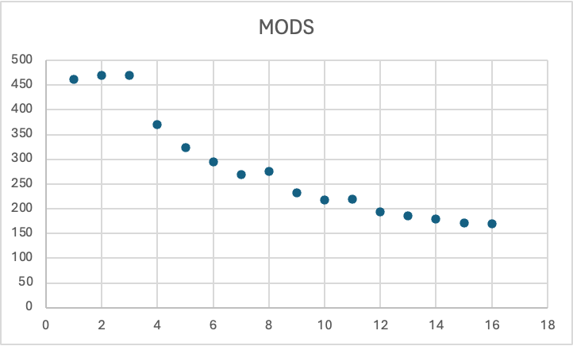

# MiniVite

Sam Ezeh, Freddie

## What is miniVite?

miniVite is a variant of Vite that only implements the first stage of the
Louvain algorithm. Calculating graph modularity is NP-hard and as such, we
approximate it using the greedy Louvain algorithm.

miniVite outputs the following values:

- Average total time (seconds)
- The time taken across each node
- Modularity (a metric that is used to partition the nodes)
- Iterations (the number of iterations required to optimise each node.)
- MODS ($\\text{Modularity} \\times \\text{Average total time}$)


## Louvain Algorithm

The Louvain algorithm works by optimising modularity on each node locally and
then grouping it into a single node repetitively. These two phases are known as
“Modularity Optimization” and “Community Aggregation”. miniVite only performs
the first phase of the algorithm which consists of assigning each node in its
community. The Louvain algorithm runs in $O(n \\log(n))$. (miniVite: Algorithms
\- ECP Proxy Applications, 2024)

**Did any of your changes impact the MODS score? What does this tell you?** Yes,
our optimisations decrease the time spent however the modularity stays the same.
As MODS is Modularity * Average total time, the MODS value decreases from
16.4711 to 8.76918 for soc-Pokec.

**What the two input files are, and whether this is compute, memory, or
communication bound.** The two input files are graphs in a special .bin format
specifically for Vite. miniVite is memory bound due to the usage of the
distributed memory Louvain method implementation.

**How are the two input graphs different?** File Size. soc-Pokec is 1.14GB,
whereas com-LiveJournal is around 0.50GB.

This indicates that soc-Pokec is a larger graph than com-LiveJournal. Both are a
representation of social networks. com-LiveJournal is made up of groups that
users can join. soc-Pokec is made up of the friendship user links.

### Scaling Graph



## Optimisations

### Compiler and BLAS library

We began by compiling miniVite with Armclang and we used the Arm Performance
Library implementation of BLAS as Armclang is able to emit instructions that are
optimised for Arm hardware and the Arm Performance Library implements BLAS
subroutines in a way that is also optimised for Arm hardware, we use this as our
baseline configuration.

### Source code optimisations

Inside the source code, we noticed several `FIXME TODO` comments. Two of
interest were the following from the `dspl.h` file.

#### 1. Concurrent vector

```cpp
for (std::map<GraphElem,Comm>::const_iterator iter = remoteCupdate.begin(); iter != remoteCupdate.end(); iter++) {
    const GraphElem i = iter->first;
    const Comm &curr = iter->second;

    const int tproc = dg.get_owner(i);
...
```

#### 2. Loop parallelisation

```cpp
for (std::vector<std::unordered_set<GraphElem>>::const_iterator iter = parray.begin(); iter != parray.end(); iter++) {
  ssz += iter->size();
  ssizes[pproc] = iter->size();
  pproc++;
}
```

I decided to begin by parallelising the second for loop by writing the following code.

```cpp
#pragma omp parallel for
for (size_t idx = 0; idx < parray.size(); ++idx) {
  ssizes[idx] = parray[idx].size();                 
}


#pragma omp parallel for reduction(+:ssz)
for (size_t i = 0; i < parray.size(); ++i) {
  ssz += parray[i].size();
}
```

I split the loop into two as I was worried about race-conditions. I wanted the
ssz reduction to be safe from race conditions but the `ssizes` initialisation is
naturally free from race conditions.

We could have replaced as the fist for loop to take advantage of TBB's [`concurrent_vector`](https://oneapi-src.github.io/oneTBB/main/tbb_userguide/concurrent_vector_ug.html) but we did not end up doing this.

### Data structure optimisation

While researching the code of the miniVite algorithm and the Louvian algorithm,
we found a branch with commits containing optimisations. While the branch did
not compile without modification, we were able to integrate these optimisations
into our local miniVite build.

[Commits](https://github.com/ECP-ExaGraph/miniVite/compare/cafc77078107df3f60b59efad5a58438b245277a...0cf9337dd1a6409df9c754ebbe34132f24dac9d5)

The first optimisation that this branch includes is an fixed-size on-stack
hashmap for small graph segments, this contrasts with the dynamically allocated
variant that the library uses by default.

The implementation of the hashmap looks like this

```cpp
// An on-stack implementation to replace hashmap
// implement the partial interface of std::unordered_map
template <typename K, typename V, int N, int R = 1> struct fakemap {
  static constexpr int radix = R;
  std::array<std::array<std::pair<K, V>, N>, R> storage;
  std::array<int, R> length = {};
  std::pair<K, V> *find(const K &k) {
    int b = k % R;
    for (int i = 0; i < length[b]; ++i)
      if (storage[b][i].first == k)
        return &storage[b][i];
    return nullptr;
  }
  void emplace(const K &k, const V &v) {
    // caller must ensure that it does not overflow
    int b = k % R;
    storage[b][length[b]++] = {k, v};
  }
};
```

You can find the commit
[here](https://github.com/ECP-ExaGraph/miniVite/commit/89dd1ed8dff02a5d3a993e6b7f791b6f3cb2f17f)

The next optimisation that this branch features is based on sorting. The Louvain
algorithm works by locally optimsing the modularitry metric by observing the
change in modularity when a vertex joins a neighbouring community. This
optimisation first sorts the vertices in the graph by their community and deals
with the change in modularity for each community by linearly scanning across
vertices in the same community which now become adjacent in contiguouse segments
in the array. This is in contrast to random access lookups with a map which is
bad for pre-fetching and branch prediction.

The implementation for this scan looks as follows. As we iterate through the
array, we check if the community has changed. If it has, we call the update
function to deal with this accordingly before continuing onto the next community.

```cpp
for (int i = 1; i < clmap.size(); ++i) {
  auto [scanningComm, scanningWeight] = clmap[i];
  if (scanningComm != tcomm) {
    update();
    tcomm = scanningComm;
    tweight = scanningWeight;
  } else {
    tweight += scanningWeight;
  }
}
```

You can find this commit
[here](https://github.com/ECP-ExaGraph/miniVite/commit/a92f5beb63f418337c936d5b787d640ca8444a94)

You can find the commit that enables these two optimisations and makes them
active in the codebase
[here](https://github.com/ECP-ExaGraph/miniVite/commit/0cf9337dd1a6409df9c754ebbe34132f24dac9d5)

## Other reasearch

In addition to the above research, we found about an optimisation for miniVite
that uses Persistent Memory and was tested on Lustre filesystem. While this
doesn't apply for us, this gave us further insight into how the Louvain
algorithm can be optimised for HPC clusters.

You can find the poster for this project
[here](https://sc20.supercomputing.org/proceedings/tech_poster/poster_files/rpost137s2-file2.pdf)

You can find the paper for this project
[here](https://sc20.supercomputing.org/proceedings/tech_poster/poster_files/rpost137s2-file3.pdf)

You can find the poster abstract for this project
[here](https://sc20.supercomputing.org/proceedings/tech_poster/tech_poster_pages/rpost137.html)

## Best results

| File name        | Variant       | Total time   | Modularity | Iterations | MODS    |
| ---------------- | ------------- | ------------ | ---------- | ---------- | ------- |
| **Live Journal** | Baseline      | 25.6391      | 0.642421   | 87         | 16.4711 |
|                  | **Optimised** | **13.6502s** | 0.642421   | 87         | 8.76918 |
| **Pokec**        | Baseline      | 5.82639      | 0.65447    | 67         | 3.8132  |
|                  | **Optimised** | **3.12556s** | 0.65447    | 67         | 2.04559 |
