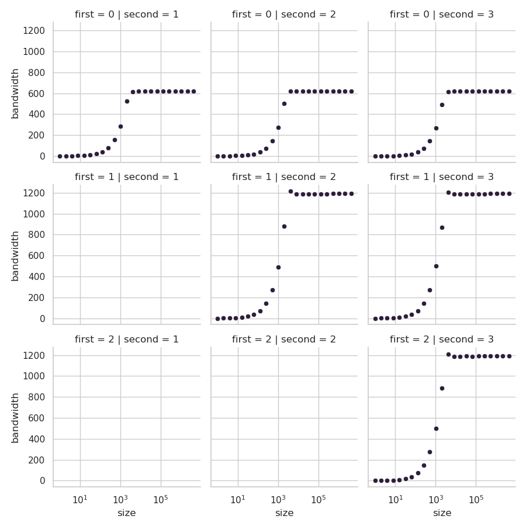
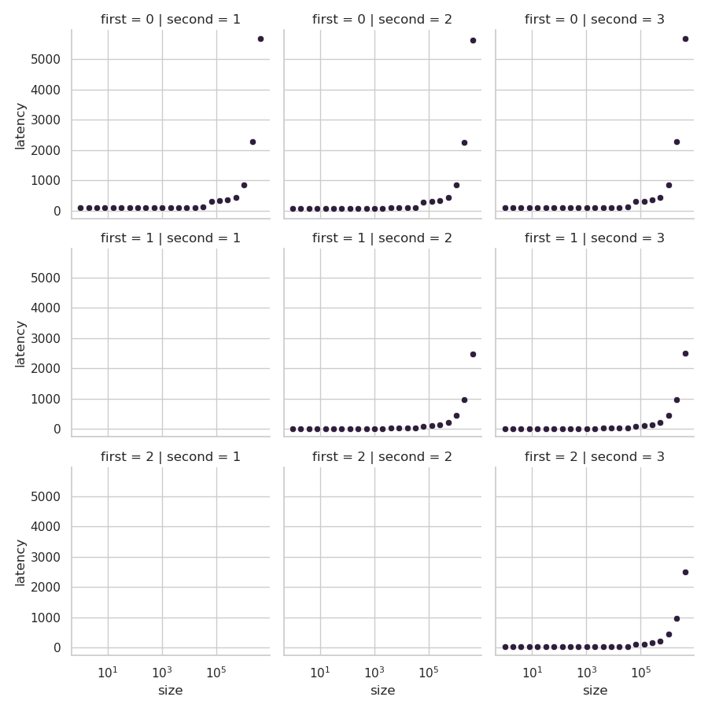
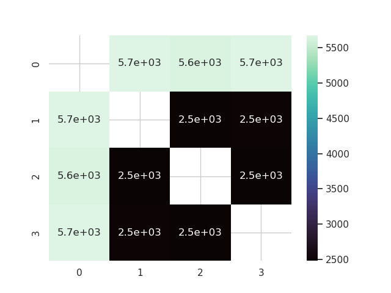

# Notes on osu
Sam Ezeh

# Installation
To install osu, we used the following script

 ```bash
git clone https://github.com/forresti/osu-micro-benchmarks
mkdir -p osu-bin
cd osu-micro-benchmarks
mkdir -p ../out
./configure --prefix=$(pwd)/../out
cd mpi/pt2pt
alias aclocals-1.15=aclocal
make CC=$(which mpicc) -j16
make install -j16
mv ../../../out/libexec/osu-micro-benchmarks/mpi/pt2pt/* ../../../osu-bin
rm -rf ../../../out
```

# Running the microbenchmarks
We used the following SLURM scripts to start the benchmarks.
Note that we need to ensure that we have exactly two processes communicating with eachother on two different nodes.
We measure both bandwidth and latency for all $\binom{4}{2}=6$ possible combinations of nodes. We use the `-w` flag to specifically request certain nodes in the cluster.

```bash
for first in {1..4}; do
  from=$(( $first + 1 ))
  for second in $(seq $from 4); do
    echo $first $second
    sbatch -N 2 --ntasks-per-node=1 -w cn0$first,cn0$second \
        --output=latency-$first-$second.out latency-script.sh
    sbatch -N 2 --ntasks-per-node=1 -w cn0$first,cn0$second \
        --output=bandwidth-$first-$second.out bandwidth-script.sh
  done
done
```

## Bandwidth
```bash
#!/usr/bin/env bash
module load libraries/openmpi
mpirun -npernode 1 ./osu-bin/osu_bw
```

## Latency
```bash
#!/usr/bin/env bash
module load libraries/openmpi
mpirun -npernode 1 ./osu-bin/osu_latency
```

# Results
To get a feel for the dynamics, we first ran the microbenchmark both latency and bandwidth on two arbitrary nodes.
After visualising the data with a graph, we notice that the maximum bandwidth attainable increases with the size of the message before reaching a plateau. A similar phenomenon occurs with latency, with the latency between the two nodes being constant against message size before beginning to increase linearly against the size of the message.

These align with expectations as low message sizes fit entirely inside the ethernet connections's bandwidth which we cannot exceed, whereas higher message sizes will have constrained throughput and will thus incur higher latency.

Note that the growth is linear but may look exponential in the graphs due to the lograithmic scaling on the x-axis.

We see a similar pattern when comparing the bandwidth and latency metrics across different message sizes between all pairs of nodes. Most nodes enjoy gigabit bandwidth however there is one node, namely `cn01`, that appears to max out at 500Mbps. This discrepency could be due to the physical location of the nodes beind different.

# Hardware analysis
We attempted to verify if these results lined up with the system's available hardware information but this proved difficult as the cluster is an AWS instance and the usual commands did not return useful information.

# Optimisation
We started by fixing nodes 2 and 3 as this pair appeared to have the best unoptimised performance. However these two nodes no longer enjoyed gigabit performance. This suggest that node labels are being shuffled, the nodes themselves aren't fixed or the presence of resource contention on the AWS machines. We still as this will improve the stability and reliability of results.

We then continued by enabling busy polling.

We then checked wheter there are CPUs that do not have a direct connection to the network interface and we found that every CPU is connected to the network adapter. If this were not the case, we would set CPU affinity so that the benchmark only runs on CPUs that have a direct connection to the network adapter.


```bash
[sezeh@login benching]$ lspci -tv
-[0000:00]-+-00.0  Amazon.com, Inc. Device 0200
           +-01.0  Amazon.com, Inc. Device 8250
           +-04.0  Amazon.com, Inc. NVMe EBS Controller
           \-05.0  Amazon.com, Inc. Elastic Network Adapter (ENA)
```

```bash
[sezeh@login benching]$ srun -N4 cat /sys/devices/pci0000\:00/0000\:00\:05.0/local_cpus
ffff
ffff
ffff
ffff
[sezeh@login benching]$ 
```

We then checked to see whether interrupt coalescing was disabled and discovered that it is.

```bash
[sezeh@login benching]$ srun -N 4 ethtool -c eth0
Coalesce parameters for eth0:
Adaptive RX: off  TX: n/a
stats-block-usecs:	n/a
sample-interval:	n/a
pkt-rate-low:		n/a
pkt-rate-high:		n/a

rx-usecs:	0
rx-frames:	n/a
rx-usecs-irq:	n/a
rx-frames-irq:	n/a

tx-usecs:	64
tx-frames:	n/a
tx-usecs-irq:	n/a
tx-frames-irq:	n/a

rx-usecs-low:	n/a
rx-frame-low:	n/a
tx-usecs-low:	n/a
tx-frame-low:	n/a

rx-usecs-high:	n/a
rx-frame-high:	n/a
tx-usecs-high:	n/a
tx-frame-high:	n/a

CQE mode RX: n/a  TX: n/a
```


We then checked to see whether jumbo frames were enabled and discovered that they are. If they had not been enabled, we would have increased the MTU to 9001 in order to enable jumbo frames.

```bash
[sezeh@login benching]$ ip link show
1: lo: <LOOPBACK,UP,LOWER_UP> mtu 65536 qdisc noqueue state UNKNOWN mode DEFAULT group default qlen 1000
    link/loopback 00:00:00:00:00:00 brd 00:00:00:00:00:00
2: eth0: <BROADCAST,MULTICAST,UP,LOWER_UP> mtu 9001 qdisc mq state UP mode DEFAULT group default qlen 1000
    link/ether 12:cf:59:23:80:95 brd ff:ff:ff:ff:ff:ff
    altname enp0s5
    altname ens5
```

We then enabled busy polling our idea was that by doing this, we could decrease latency but there were no significant effects here.

```bash
echo 50 | sudo tee /proc/sys/net/core/busy_poll
echo 50 | sudo tee /proc/sys/net/core/busy_read
```

We then increased the size of the TCP socket write and receive buffers but did ot see any significant effects.

```
echo "8192 262144 536870912" | sudo tee /proc/sys/net/ipv4/tcp_rmem
echo "4096 16384 536870912" | sudo tee /proc/sys/net/ipv4/tcp_wmem
echo -2 | sudo tee /proc/sys/net/ipv4/tcp_adv_win_scale
```

# Images


## Node to node bandwidth plot


## Node to node latency plot


## Maximum bandwidth heatmap



# Command line diagnostic output

## `lshw` output
```bash
[sezeh@login ~]$ lshw -class network
  *-network                 
       description: Ethernet interface
       product: Elastic Network Adapter (ENA)
       vendor: Amazon.com, Inc.
       physical id: 5
       bus info: pci@0000:00:05.0
       logical name: eth0
       version: 00
       serial: 12:cf:59:23:80:95
       width: 32 bits
       clock: 33MHz
       capabilities: pciexpress msix pm bus_master cap_list ethernet physical
       configuration: broadcast=yes driver=ena driverversion=5.14.0-362.24.1.el9_3.0.1.aarch ip=172.31.92.121 latency=0 link=yes multicast=yes
       resources: irq:13 memory:80104000-80105fff memory:80106000-80107fff memory:80000000-800fffff
```

## `lspci` output
```bash
[sezeh@login ~]$ lspci -v
00:00.0 Host bridge: Amazon.com, Inc. Device 0200
	Physical Slot: 0
	Flags: fast devsel

00:01.0 Serial controller: Amazon.com, Inc. Device 8250 (prog-if 03 [16650])
	Physical Slot: 1
	Flags: fast devsel, IRQ 14
	Memory at 80108000 (32-bit, non-prefetchable) [size=4K]
	Kernel driver in use: serial

00:04.0 Non-Volatile memory controller: Amazon.com, Inc. NVMe EBS Controller (prog-if 02 [NVM Express])
	Subsystem: Amazon.com, Inc. Device 0000
	Physical Slot: 4
	Flags: bus master, fast devsel, latency 0, IRQ 12, NUMA node 0
	Memory at 80100000 (32-bit, non-prefetchable) [size=16K]
	Capabilities: <access denied>
	Kernel driver in use: nvme
	Kernel modules: nvme

00:05.0 Ethernet controller: Amazon.com, Inc. Elastic Network Adapter (ENA)
	Subsystem: Amazon.com, Inc. Elastic Network Adapter (ENA)
	Physical Slot: 5
	Flags: bus master, fast devsel, latency 0, IRQ 13
	Memory at 80104000 (32-bit, non-prefetchable) [size=8K]
	Memory at 80106000 (32-bit, non-prefetchable) [size=8K]
	Memory at 80000000 (32-bit, prefetchable) [size=1M]
	Capabilities: <access denied>
	Kernel driver in use: ena
	Kernel modules: ena
```

## `ethtool eth0`

```bash
[sezeh@login ~]$ sudo ethtool eth0
Settings for eth0:
        Current message level: 0x000004e3 (1251)
                               drv probe ifup rx_err tx_err tx_done
	Link detected: yes
```

# Script listing
